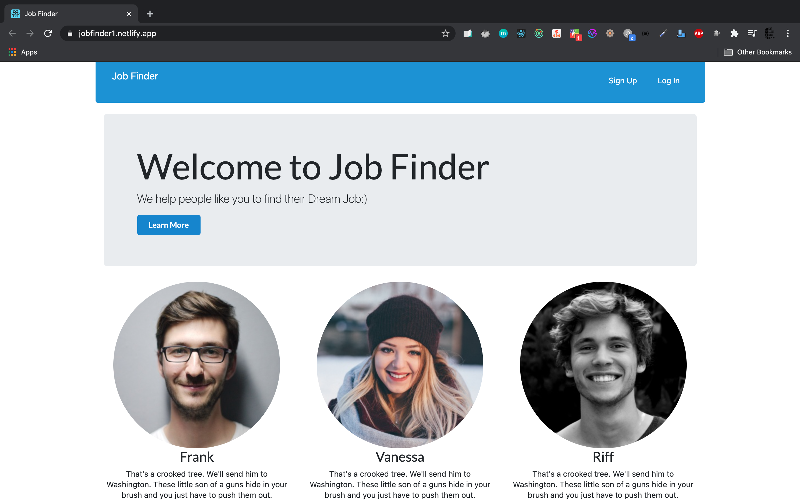
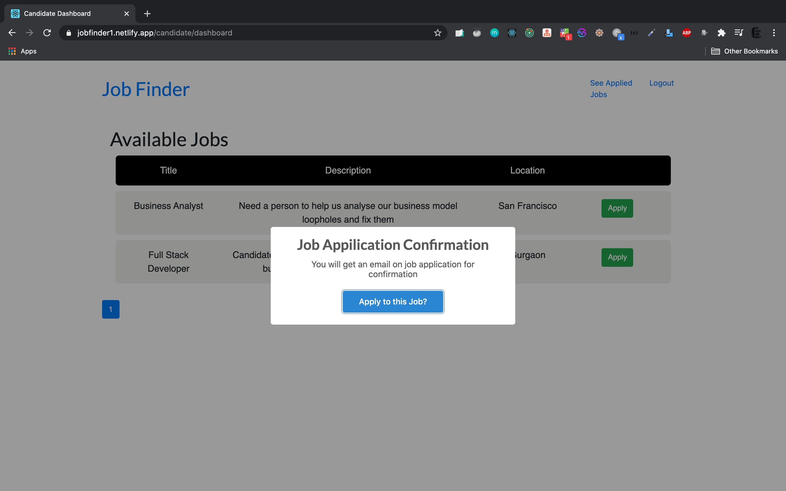

#  [Job Finder](https://jobfinder1.netlify.app) 

[Job finder](https://jobfinder1.netlify.app) is a full stack web application where `Recruiters` can post jobs, `Candidates` can apply to those jobs, and `Admins` can access all the data and can delete users and posted jobs if they want.

## Tech Stack
- **Express.js** for writing REST API endpoints.
- **MySql** for database.
- **React.js** as frontend library and **Redux** for frontend state management.
- **Nodemailer** for sending emails to candidates and recruiters on a new job application.

## Platforms used for deployment
- Backend Server is hosted on [Heroku](https://heroku.com)
- Frontend Server is hosted on [Netlify](https://netlify.com)
- Database Server is hosted on [Clever-cloud](https://clever-cloud.com)

> Since the whole application is hosted on multiple platforms, it might be a little slow for first time response depending on various factors including your Geographical location and time.
